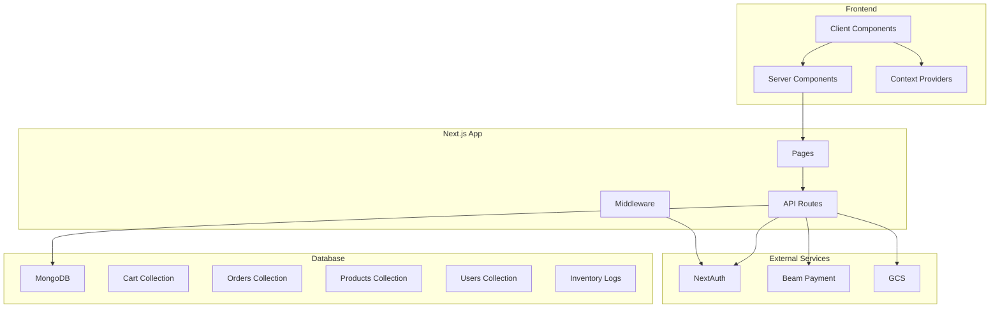

# GacharShop Project Review & Improvement Plan

**Review Date**: January 2026  
**Current Status**: Phase 3.7 Completed (Mobile-First, Cart, Transactions)  
**Reviewer**: Architect Mode Analysis

---

## Executive Summary

GacharShop is a well-structured Next.js e-commerce application with solid foundations in:
- ✅ Proper use of MongoDB transactions for inventory management
- ✅ Mobile-first responsive design
- ✅ Clean separation of concerns (models, API routes, components)
- ✅ Good audit trail implementation (InventoryLog)

**Critical Areas for Improvement**:
1. Security vulnerabilities (admin endpoints, input validation)
2. Performance issues (database queries, missing caching)
3. Code quality issues (type safety, error handling)
4. Missing features (search, pagination, analytics)
5. Infrastructure gaps (monitoring, rate limiting)

---

## 1. Security Improvements

### 1.1 Critical Security Issues

| Issue | Location | Severity | Recommendation |
|-------|----------|----------|----------------|
| Missing admin role verification | [`app/api/admin/inventory/route.ts:14-23`](app/api/admin/inventory/route.ts:14) | 🔴 Critical | Add strict admin role check |
| No rate limiting on public APIs | All API routes | 🔴 Critical | Implement rate limiting middleware |
| Missing input validation | [`app/api/orders/route.ts`](app/api/orders/route.ts) | 🟠 High | Add Zod validation schemas |
| Cron endpoint unsecured | [`app/api/cron/release-stock/route.ts:11`](app/api/cron/release-stock/route.ts:11) | 🔴 Critical | Add Authorization header check |
| Exposed error details | All API routes | 🟠 High | Sanitize error responses in production |

### 1.2 Security Implementation Plan

```typescript
// Recommended: Middleware-based rate limiting
// lib/middleware/rateLimit.ts
import { Ratelimit } from "@upstash/ratelimit";
import { Redis } from "@upstash/redis";

const ratelimit = new Ratelimit({
  redis: Redis.fromEnv(),
  limiter: Ratelimit.slidingWindow(100, "1 m"),
});

// Apply to API routes via middleware
```

### 1.3 Admin Verification Fix

```typescript
// In app/api/admin/inventory/route.ts
const admin = await User.findOne({ email: session.user.email });
if (!admin || admin.role !== 'admin') {
    return NextResponse.json({ error: 'Forbidden' }, { status: 403 });
}
```

---

## 2. Performance Optimizations

### 2.1 Database Query Optimization

**Current Issues**:
- [`app/products/page.tsx:20-21`](app/products/page.tsx:20) - Missing pagination
- [`app/api/admin/inventory/route.ts:95`](app/api/admin/inventory/route.ts:95) - Large data fetch without pagination
- [`app/api/cart/route.ts:137-146`](app/api/cart/route.ts:137) - Inefficient quota check (N+1 query)

**Recommended Improvements**:

```typescript
// Add pagination to products API
export async function GET(req: Request) {
    const { searchParams } = new URL(req.url);
    const page = parseInt(searchParams.get('page') || '1');
    const limit = parseInt(searchParams.get('limit') || '20');
    
    const products = await Product.find({ status: 'active' })
        .skip((page - 1) * limit)
        .limit(limit)
        .lean();
        
    return NextResponse.json({
        products,
        pagination: { page, limit, total: await Product.countDocuments() }
    });
}

// Optimize quota check with aggregation
const boughtCount = await Order.aggregate([
    { $match: { user: user._id, 'items.product': productId } },
    { $unwind: '$items' },
    { $match: { 'items.product': productId } },
    { $group: { _id: null, total: { $sum: '$items.quantity' } } }
]);
```

### 2.2 Caching Strategy

| Area | Current | Recommended |
|------|---------|-------------|
| Product listing | No cache | Next.js `unstable_cache` or Redis |
| Category data | No cache | Cache for 1 hour |
| Inventory counts | Real-time | Stale-while-revalidate |

### 2.3 Image Optimization

- Add `sizes` prop to Next.js Image components
- Implement lazy loading for below-fold images
- Consider using Next.js Image Optimization API

---

## 3. Code Quality Improvements

### 3.1 Type Safety Issues

| File | Issue | Fix |
|------|-------|-----|
| [`CartContext.tsx:23`](context/CartContext.tsx:23) | `product: any` | Define `CartProduct` interface |
| [`ProductDetail.tsx:10`](components/ProductDetail.tsx:10) | `product: any` | Define `Product` interface |
| [`app/api/cart/route.ts:137`](app/api/cart/route.ts:137) | `order: any` | Import `Order` type |
| Global | Missing strict null checks | Enable in `tsconfig.json` |

### 3.2 Error Handling Improvements

```typescript
// Current: Generic error logging
} catch (error) {
    console.error('Fetch orders error:', error);
    return NextResponse.json({ error: 'Internal Server Error' }, { status: 500 });
}

// Improved: Structured error handling
interface ApiError {
    code: string;
    message: string;
    details?: any;
}

class ApiError extends Error {
    constructor(
        public statusCode: number,
        message: string,
        public details?: any
    ) {
        super(message);
    }
}

// Usage
throw new ApiError(400, 'Not enough stock', { productId, requested: 10, available: 5 });
```

### 3.3 Code Duplication

- Extract cart cleanup logic from [`app/api/cart/route.ts`](app/api/cart/route.ts) to `lib/cart.ts`
- Create shared validation schemas using Zod
- Extract inventory log creation to helper function

---

## 4. Feature Enhancements

### 4.1 Search & Filtering

```typescript
// Add to products API
export async function GET(req: Request) {
    const { searchParams } = new URL(req.url);
    const query = searchParams.get('q');
    const minPrice = parseInt(searchParams.get('minPrice') || '0');
    const maxPrice = parseInt(searchParams.get('maxPrice') || '999999');
    
    const filter: any = { status: 'active' };
    
    if (query) {
        filter.$or = [
            { name: { $regex: query, $options: 'i' } },
            { description: { $regex: query, $options: 'i' } }
        ];
    }
    
    if (minPrice || maxPrice) {
        filter.price = {};
        if (minPrice) filter.price.$gte = minPrice;
        if (maxPrice) filter.price.$lte = maxPrice;
    }
    
    // ... rest of implementation
}
```

### 4.2 Order Status Webhooks

Currently orders rely on cron jobs for stock release. Add webhook support:

```typescript
// app/api/webhooks/beam/route.ts
export async function POST(req: Request) {
    const signature = req.headers.get('x-beam-signature');
    
    if (!verifyBeamWebhookSignature(signature, body)) {
        return NextResponse.json({ error: 'Invalid signature' }, { status: 401 });
    }
    
    const { event, orderId, paymentStatus } = await req.json();
    
    if (event === 'payment.completed' && paymentStatus === 'success') {
        // Update order status to 'paid'
        // Send confirmation email
        // Deduct final stock (if holding in reserved)
    }
}
```

### 4.3 Analytics Dashboard

- Track conversion rates
- Monitor inventory turnover
- Implement daily/weekly reports
- Add real-time inventory alerts

---

## 5. Infrastructure & DevOps

### 5.1 Missing Infrastructure

| Component | Current | Recommended |
|-----------|---------|-------------|
| Monitoring | None | Sentry or LogRocket |
| Analytics | None | Google Analytics 4 |
| Error tracking | Console logs | Structured logging (Winston/Pino) |
| CI/CD | Manual | GitHub Actions pipeline |

### 5.2 Environment Configuration

```yaml
# env.example.yaml - Add missing configurations
env:
  # Existing configs...
  
  # New recommended configs:
  SENTRY_DSN: "${SENTRY_DSN}"
  NEXT_PUBLIC_GA_ID: "${NEXT_PUBLIC_GA_ID}"
  RATE_LIMIT_REQUESTS_PER_MINUTE: "100"
  LOG_LEVEL: "info"
```

### 5.3 Testing Strategy

```typescript
// Recommended test structure
tests/
├── unit/
│   ├── lib/
│   │   ├── db.test.ts
│   │   └── beam.test.ts
│   └── components/
│       ├── Header.test.tsx
│       └── ProductDetail.test.tsx
├── integration/
│   ├── api/
│   │   ├── orders.test.ts
│   │   └── cart.test.ts
│   └── checkout.flow.test.ts
└── e2e/
    └── checkout.spec.ts
```

---

## 6. UI/UX Improvements

### 6.1 Accessibility

- Add ARIA labels to all interactive elements
- Implement keyboard navigation
- Add skip links for screen readers
- Ensure color contrast compliance (WCAG 2.1)

### 6.2 Loading States

- Add skeleton loaders for product lists
- Implement optimistic UI updates
- Add progress indicators for cart operations

### 6.3 Mobile Experience

- Improve touch target sizes (minimum 44px)
- Add pull-to-refresh functionality
- Optimize bottom navigation behavior

---

## 7. Implementation Priority Matrix

| Priority | Task | Effort | Impact |
|----------|------|--------|--------|
| P0 | Fix admin role verification | Low | Critical |
| P0 | Secure cron endpoint | Low | Critical |
| P0 | Add rate limiting | Medium | Critical |
| P1 | Implement pagination | Medium | High |
| P1 | Add type safety | Medium | High |
| P1 | Optimize quota check query | Low | Medium |
| P2 | Add search functionality | Medium | High |
| P2 | Implement webhook handling | Medium | High |
| P2 | Add monitoring (Sentry) | Medium | Medium |
| P3 | Add analytics | Low | Medium |
| P3 | UI/UX improvements | Ongoing | Medium |

---

## 8. Recommended Next Steps

1. **Immediate (This Sprint)**:
   - Fix critical security vulnerabilities (P0 items)
   - Add admin role verification
   - Secure cron endpoint

2. **Short-term (2-4 weeks)**:
   - Implement pagination and search
   - Add type safety improvements
   - Optimize database queries

3. **Medium-term (1-2 months)**:
   - Add monitoring and analytics
   - Implement webhooks for payment processing
   - Add comprehensive test coverage

4. **Ongoing**:
   - UI/UX improvements
   - Performance optimization
   - Security audits

---

## Appendix: Project Architecture Diagram



---

## Appendix: File Reference Summary

| Category | Key Files |
|----------|-----------|
| Database Models | [`models/Product.ts`](models/Product.ts), [`models/Order.ts`](models/Order.ts), [`models/User.ts`](models/User.ts) |
| Database Connection | [`lib/db.ts`](lib/db.ts) |
| Cart Logic | [`context/CartContext.tsx`](context/CartContext.tsx), [`app/api/cart/route.ts`](app/api/cart/route.ts) |
| Order Processing | [`app/api/orders/route.ts`](app/api/orders/route.ts) |
| Admin Inventory | [`app/api/admin/inventory/route.ts`](app/api/admin/inventory/route.ts) |
| Cron Jobs | [`app/api/cron/release-stock/route.ts`](app/api/cron/release-stock/route.ts) |
| Payment | [`lib/beam.ts`](lib/beam.ts) |
| Components | [`components/Header.tsx`](components/Header.tsx), [`components/ProductDetail.tsx`](components/ProductDetail.tsx) |
| Configuration | [`package.json`](package.json), [`next.config.ts`](next.config.ts), [`tsconfig.json`](tsconfig.json) |
